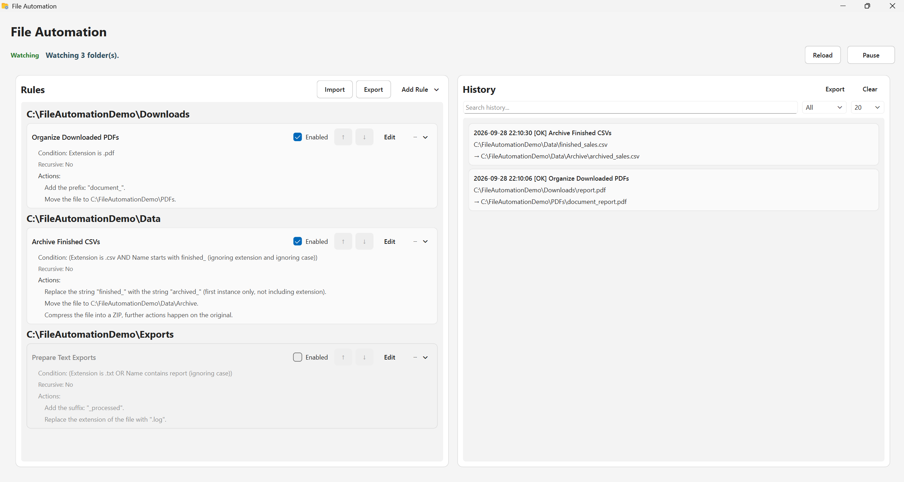
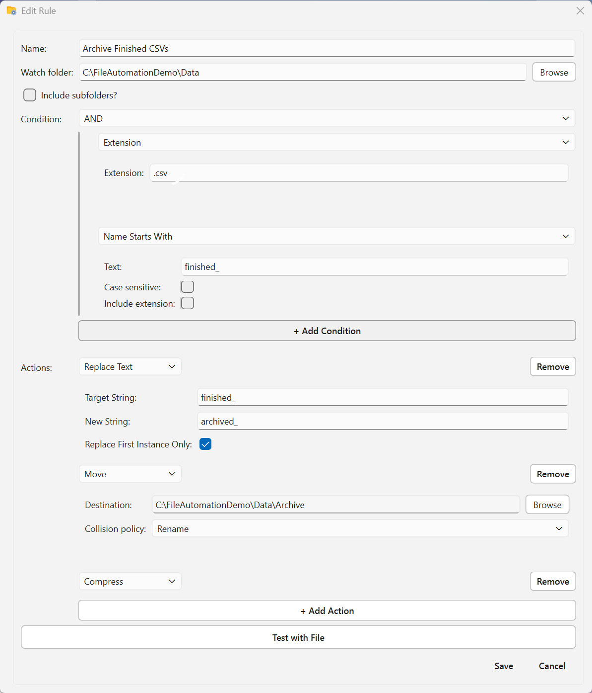
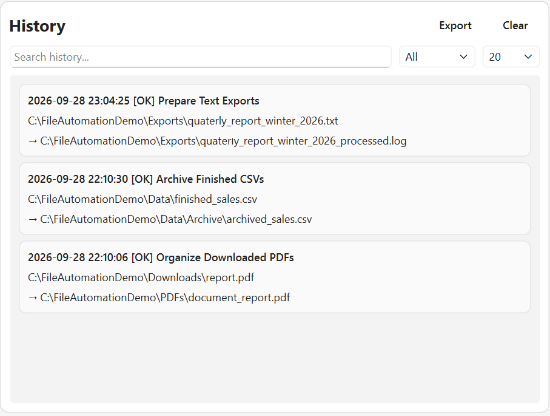

# File Automation App

File Automation App is an application built with Python and PySide6 that monitors folders and automatically processes files based on user-defined rules. Each rule combines conditions, such as having certain file extensions or matching file name patterns, with one or more actions, such as renaming, moving, compressing, or deleting files.

Some features included in this project are a graphical rule editor, nested condition groups, chained actions, rule priorities, history logging, import/export support, a command-line interface, and protection against duplicate filesystem events and processing loops.

## Features
- Create custom automation rules for given folders.
- Combine multiple conditions via nested AND and OR conditions.
- Chain multiple actions together so the output of one becomes the target of the next.
- Enable, disable, reorder, edit, and duplicate rules via the GUI.
- Monitor multiple folders, including recursive subdirectories.
- Record rule execution results and failures via a history log.
- Import and export rules in JSON.
- Create rules from reusable templates.
- Run the automation engine via the desktop interface or the CLI.

## Screenshots

### Main Window



### Rule Editor



### History



## How It Works
File automation in this app is based on a collection of rules. Rules can be created and assigned to watch certain folders (and possibly their children). When a file is created or moved into that folder, each associated rule checks if that file matches its condition. If the file does match a rule's condition, the highest priority rule will execute each of its configured actions on that file.

Rule Usage:
1. Select a folder to monitor.
2. Specify the conditions that determine which files will match the rule.
3. Add actions to perform on any matching files.
4. Enable the rule and start the watcher.
5. When a matching file appears, the actions will execute in order.

Rules are evaluated based on priority. The first matching rule handles the file. This prevents multiple unrelated rules from processing the same event unexpectedly.
Actions are chained together. If an action changes the file path, such as a rename or move operation, the next action operates on the updated path.

## Supported Conditions
- **Extension**: Matches files with a specified extension (.txt, .py, etc.).
- **Name Contains**: Matches filenames containing a specified string.
- **Name Starts With**: Matches filenames beginning with a specified string.
- **Name Ends With**: Matches filenames ending with a specified string.
- **Exact Name**: Matches a specific filename exactly.
- **File Size**: Matches files based on their size.
- **AND Group**: Requires all nested conditions to match.
- **OR Group**: Requires at least one nested condition to match.
Conditions can support additional toggles, for example if file name conditions are case sensitive, or whether they should exclude the extension when considering the name.

## Supported Actions
- **Move**: Moves a file to another directory.
- **Copy**: Creates a copy of a file in another directory (further actions will operate on the original).
- **Compress**: Creates a ZIP archive containing the file.
- **Prefix Rename**: Adds text to the beginning of the filename.
- **Suffix Rename**: Adds text to the end of the filename.
- **Replace Text**: Replaces part of the filename.
- **Change Extension**: Changes the file extension.
- **Execute Script**: Runs an external Python, Bash, JavaScript, or PowerShell script and passes the file path to it.
- **Delete**: Moves the file to the trash or permanently deletes it.

Multiple actions can be attached to the same rule and are executed sequentially.
Script execution requires that the appropriate runtime is installed (e.g. Python, Bash, Node.js, or PowerShell).
Files created by a rule will not trigger another rule execution even if it matches a rule in its new folder.

## Example Automation
For example, a rule could automatically organize downloaded PDF files:
- Watch the `Downloads` folder
- Match files with the extension `.pdf`
- Add the prefix `document_`
- Move the renamed file into `Documents/PDFs`

Another rule could oversee a data folder that is actively being worked on, and automatically archive files when the user marks them as finished.
- Watch the `data` folder
- Match files that both:
      - have the extension `.csv`
      - have a name starting with `finished_`
- Replace the first `finished_` with `archived_`
- Move the file to an `archive` folder
- Create a compressed version of the file
- Delete the original, non-compressed version of the file

## History and Error Handling
Any attempts at processing a file are recorded in a history log. Each attempt creates an entry in this log that identifies information like if the rule succeeded and other information about the file and rule. Any exceptions raised during rule processing are recorded.

## Filesystem Safety
Due to the nature of this application, there are safety measures in place to avoid dangerous operations:
      - Several folders that all move a file between each other in an endless loop.
      - A copy or compression action creating an additional file in the same folder, which endlessly creates more and more copies/compresses.
      - An intermediate operation like a rename triggers an additional rule to execute on the file, creating a race condition to see which edits the file first.
      
To preserve file safety, File Automation App keeps track of all recently processed file paths and puts these paths on cooldown, prohibiting any further rules from being executed on them until the cooldown finishes.

## Installation
You can run File Automation App directly from source using Python.

### Requirements
This application requires the following Python dependencies:
- PySide6
- watchdog
- Send2Trash

### Clone the Repository

```
git clone https://github.com/ryanly6565/file-automation-app.git
cd file-automation-app
```

### Create a Virtual Environment

To create the virtual environment (this keeps the project's packages separate from your system's packages):

On Windows:

```powershell
python -m venv .venv
.\.venv\Scripts\Activate.ps1
```

On Linux or WSL:

```bash
python3 -m venv .venv
source .venv/bin/activate
```

Upon successful activation, your terminal should look something like:

```text
(.venv)
```

### Install Dependencies

To install the required Python packages:

```bash
python3 -m pip install -r requirements.txt
```

If you wish to test the application or package the application, install the dev dependencies:

```bash
python3 -m pip install -r requirements_dev.txt
```

### Run the Application
From the project root directory, run:
```bash
python3 -m src.ui
```
This should open the graphical interface and allow rule creation/execution.

# Windows Build

File Automation App can also be packaged as a Windows application using PyInstaller. In other words, it can be turned into an executable file that can run without having to manually use Python.

### Build the Application

Run the following command from the project root to create a Linux packaged version:
```bash
python3 -m PyInstaller \
  --clean \
  --noconfirm \
  --distpath dist-linux \
  --workpath build-linux \
  packaging/FileAutomationApp.linux.spec
```

Then use it with:
```bash
./dist-linux/FileAutomationApp/FileAutomationApp
```

Run the following command from the project root to create the Windows executable:

```powershell
python -m PyInstaller `
  --clean `
  --noconfirm `
  --distpath dist-windows `
  --workpath build-windows `
  packaging\FileAutomationApp.windows.spec
```

This will generate the executable file at:

```text
dist-windows\FileAutomationApp\FileAutomationApp.exe
```

Note that if this app is intended to be used through WSL, the Linux version should be used, not the Windows version.

## Command-Line Interface

File Automation App can also be run through a command-line interface without a GUI. This will use the same rules and logic as the graphical version, but does not support editing or rule creation.

Run the CLI from the project root with:

```bash
python3 -m src.cli <rules.json>
```

The CLI is intended to be used for running the automation automatically and without the GUI. 

## Configuration

Rule information is stored in JSON-formatted files for persistence between sessions.

Each rule stores information including:

- the folder being watched
- if the rule is enabled
- if subdirectories should be recursively monitored
- the condition files must meet for the actions to be executed
- the sequence of actions to execute

Custom rules files can be imported/exported from the GUI.

An example section of a rule configuration may look like:

```json
{
  "folder": "Downloads",
  "enabled": true,
  "recursive": false,
  "condition": {
    "type": "extension",
    "extension": ".pdf"
  }
}
```

Users should not need to edit the JSON manually.

## Project Structure
```text
file-automation-app/
├── src/
│   ├── ui.py
│   ├── cli.py
│   ├── watcher.py
│   ├── rules.py
│   ├── conditions.py
│   ├── actions.py
│   ├── rule_validation.py
│   ├── config_loader.py
│   └── history.py
├── tests/
├── assets/
├── config/
├── history/
├── README.md
└── requirements.txt
```

Automation logic is kept separate from user interfaces.

The core automation logic is kept separate from the graphical interface. Conditions determine whether a file matches a rule, actions perform filesystem operations, rules coordinate action execution, and the watcher connects filesystem events to the rule engine.

## Architecture
Filesystem Event Occurs
(for example, file creation or renaming)
      ↓
Watcher Is Alerted
      ↓
Rule Matching
      ↓
Condition Tree
      ↓
Action Chain
      ↓
History / Logging

Filesystem events are generated and passed to the watcher.

Each watcher will evaluate any rules in priority order, so the first to match will execute its chain of actions.

If a filesystem event alerts the watchers of overlapping folders (i.e. a folder is alerted as well as its parent folder who is recursively watching its child folders), the watchers of all those folders will receive that filesystem event. In that case, there is no global priority and the first one to successfully match that file will claim it, while the others will ignore it.

## Testing
The project uses pytest for unit and integration testing. To test the application, run:
python3 -m pytest -v

Tests cover:
- individual conditions
- individual actions
- action chaining
- JSON configuration loading and serialization
- rule validation
- file expiration / rename / collision behavior
- duplicate watcher events
- overlapping watched folders
- intermediate paths produced during chained actions
- script execution behavior

Watcher integration tests use real temporary directories to verify that filesystem events produce the expected final files without duplicate history entries.

## Design Decisions
### First Matching Rule Wins
Rules are kept in priority order (represented in the GUI as the first rule from the top in its given folder). After a matching rule is found, lower priority rules are not considered and ignored for that event. This was done in order to keep rule behaviour simple and predictable, avoiding any situations where several rules are all trying to edit and change the same file.

### Action Chaining
After a rule executes an action in its sequence of actions, the file path that should be used for the next action is returned. For example, after a rename action, the next action in the rule will use the renamed file rather than the original name. Actions like copy and compress (which create new files) return the original file path.

### Collision Handling
When an operation creates a file that already exists, the app will generate a new filename instead of overwriting the existing file.

### Delete Validation
Delete actions are required to be the final action in a rule's action chain. This is because later actions would otherwise attempt to operate on a file that no longer exists.

## Technologies
- **Python**: Core application and automation engine
- **PySide6 / Qt**: Desktop user interface
- **watchdog**: Filesystem monitoring
- **pytest**: Automated testing
- **Send2Trash**: Safe trash/recycle-bin deletion
- **PyInstaller**: Native application packaging
- **JSON**: Rule persistence and import/export

## Limitations
- External script actions require the corresponding runtime to be installed.
- JavaScript scripts require Node.js.
- PowerShell scripts require a PowerShell runtime. On Windows, `powershell.exe` is supported. On Linux `pwsh` is supported.
- Bash scripts require a Bash environment.
- Filesystem behavior may vary slightly between operating systems.

The application currently focuses on local filesystem automation rather than cloud storage or network-mounted workflow systems.

## Future Improvements
- Additional UI and error-state polish
- Additional automation conditions and actions

## License
This project is licensed under the MIT License. See [LICENSE](LICENSE) for details.